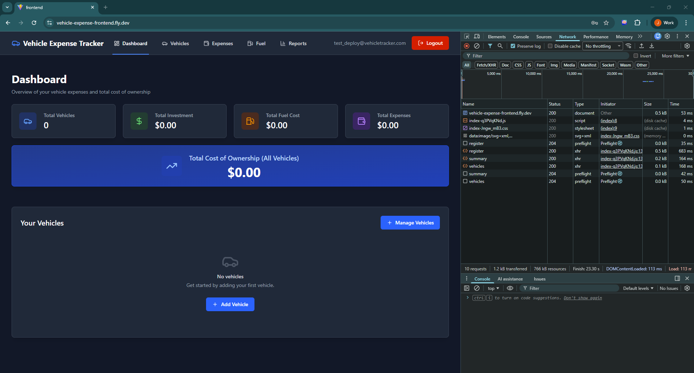
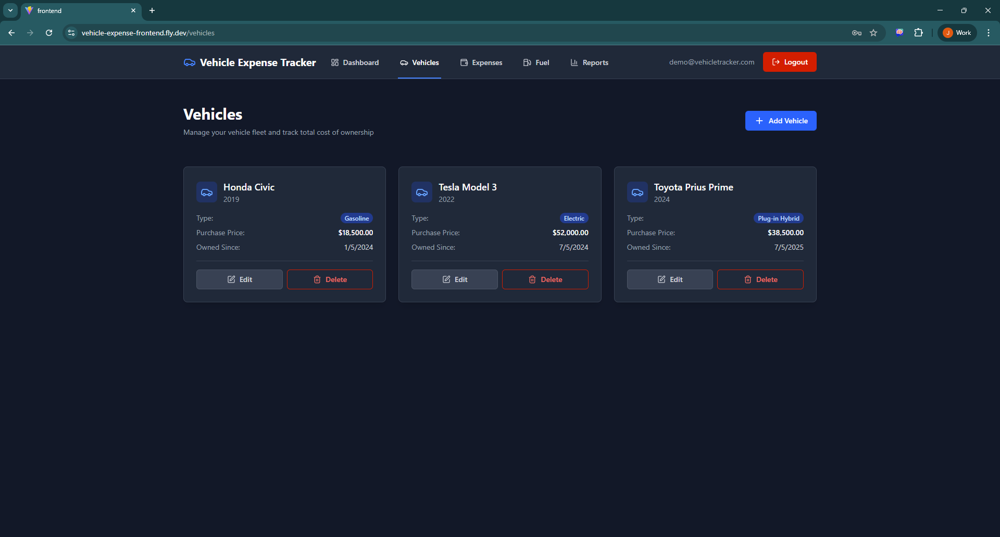
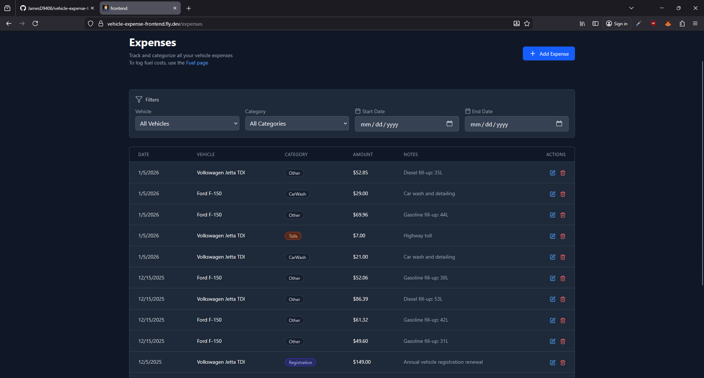
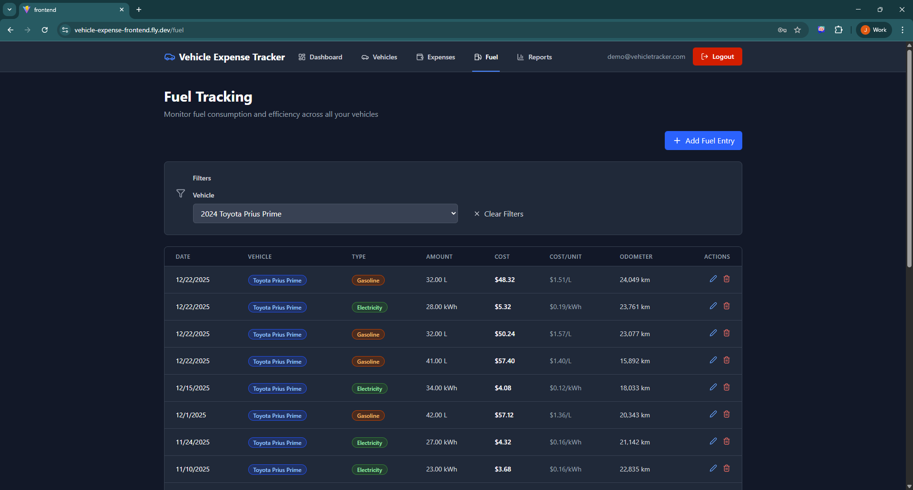
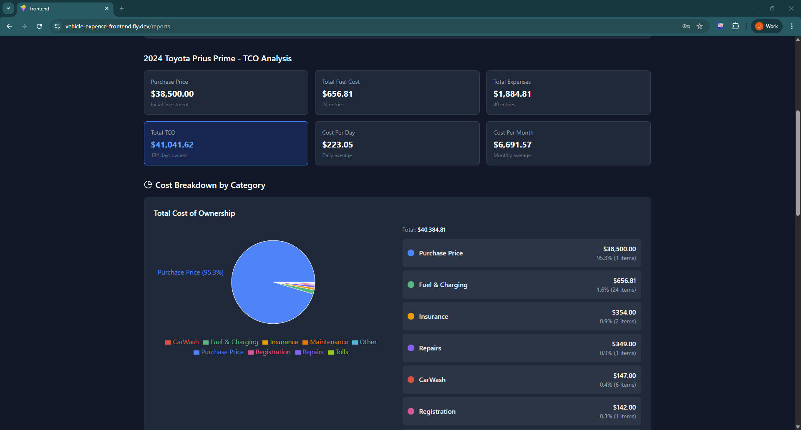

# Vehicle Expense Tracker — Full-Stack TCO Calculator

[](https://vehicle-expense-frontend.fly.dev)


A full-stack vehicle expense tracking application that calculates the **true Total Cost of Ownership (TCO)** for your vehicles. Built with **ASP.NET Core 8**, **React 19**, **TypeScript**, and **PostgreSQL**, deployed on **Fly.io** with **Docker** containerization.

This project demonstrates backend expertise, RESTful API design, JWT authentication, database architecture, frontend development, and modern DevOps practices.

**Live Demo:** [https://vehicle-expense-frontend.fly.dev](https://vehicle-expense-frontend.fly.dev)

**Demo Credentials:**

The application is seeded with three test accounts (all use password: Test123):

1. **Demo Account**
   - Email: demo@vehicletracker.com
   - Password: Test123

2. **Test Account**
   - Email: test@vehicletracker.com
   - Password: Test123

3. **Admin Account**
   - Email: admin@vehicletracker.com
   - Password: Test123

---

## 🚀 Features

### 🔐 Authentication & User Management
- JWT-based authentication with ASP.NET Core Identity
- Secure user registration and login
- Protected API endpoints with user data isolation
- Token-based authorization with Bearer tokens

### 🚗 Vehicle Management
- Track multiple vehicles (Gas, Diesel, Electric, Hybrid, Plug-in Hybrid)
- Record purchase price and ownership period
- View detailed vehicle information and history
- Calculate per-vehicle TCO and ownership costs

### 💰 Expense Tracking
- Log expenses across 10 categories:
  - Fuel, Maintenance, Insurance, Registration
  - Repairs, Parking, Tolls, Car Wash
  - Modifications, Other
- Filter expenses by vehicle or category
- Track expense history over time
- Automatic fuel expense creation from fuel entries

### ⛽ Fuel Logging & Efficiency
- Log fuel fill-ups with odometer readings
- Automatic fuel efficiency calculations (L/100km, MPG, kWh/100km)
- Smart energy type detection (gasoline, diesel, electricity)
- Support for hybrid vehicles (dual energy types)
- Fuel cost per kilometer tracking
- Efficiency trend analysis

### 📊 Reports & Analytics
- **TCO Dashboard** — Total cost of ownership across all vehicles
- **Cost Breakdown** — Visual pie charts by category
- **Monthly Trends** — Line charts showing spending patterns
- **Fuel Efficiency Metrics** — Performance analytics
- **Per-Vehicle Analysis** — Individual vehicle cost summaries

### 📄 Document Management
- Receipt upload with two-step process (upload + link to expense)
- OCR stub for future text extraction
- User-specific file storage
- File type validation (JPEG, PNG, PDF)
- 5MB file size limit

---

## 📸 Screenshots

### 🟦 Dashboard Overview
<p>Shows TCO summary, vehicle count, and quick-access cards.</p>
<div style="display: flex; gap: 12px; margin-bottom: 20px;">
 
</div>

### 🟧 Vehicle Management
<p>List, add, edit, and view detailed vehicle information.</p>
<div style="display: flex; gap: 12px; margin-bottom: 20px;">
   
</div>

### 🟨 Expense Tracking
<p>Filter and manage expenses by category and vehicle.</p>
<div style="display: flex; gap: 12px; margin-bottom: 20px;">
   
</div>

### 🟨 Fuel Tracking
<p>Filter and manage expenses by category and vehicle.</p>
<div style="display: flex; gap: 12px; margin-bottom: 20px;">
   
</div>

### 🟩 Reports & Analytics
<p>Visual analytics with charts and TCO breakdowns.</p>
<div style="display: flex; gap: 12px; margin-bottom: 20px;">
    
</div>

---

## 🛠️ Tech Stack

### Backend (ASP.NET Core 8)
| Technology | Purpose |
|------------|---------|
| **ASP.NET Core 8** | Web API framework |
| **Entity Framework Core 8** | ORM for PostgreSQL |
| **ASP.NET Identity** | User authentication & management |
| **JWT Bearer** | Token-based authentication |
| **FluentValidation 11** | Input validation |
| **Npgsql** | PostgreSQL data provider |
| **xUnit** | Unit testing (12 tests passing) |

### Frontend (React 19)
| Technology | Purpose |
|------------|---------|
| **React 19** | UI framework |
| **TypeScript 5** | Type safety |
| **Vite 7** | Build tool & dev server |
| **React Router 7** | Client-side routing |
| **TailwindCSS 4** | Utility-first styling |
| **Axios** | HTTP client |
| **Recharts 3** | Data visualization |
| **Lucide React** | Icon library |

### DevOps & Deployment
| Technology | Purpose |
|------------|---------|
| **Docker** | Multi-stage containerization |
| **Docker Compose** | Local development orchestration |
| **Fly.io** | Cloud hosting platform |
| **PostgreSQL** | Production database |
| **Nginx** | Production frontend server |

---

## 📦 Database Schema

### **User**
- `Id` (string) — Primary key
- `Email` (string) — Unique identifier, login credential
- `PasswordHash` (string) — Hashed password
- `CreatedAt` (DateTime) — Account creation timestamp
- Relations: Has many vehicles, expenses, fuel entries

### **Vehicle**
- `Id` (int) — Primary key
- `Make`, `Model`, `Year` — Vehicle identification
- `VehicleType` (enum) — Gas, Diesel, Electric, Hybrid, PlugInHybrid
- `PurchasePrice` (decimal) — Initial cost
- `PurchaseDate`, `SoldDate` (DateOnly) — Ownership period
- `Odometer` (int) — Current mileage
- `UserId` (string) — Foreign key to User
- Relations: Has many expenses, fuel entries

### **Expense**
- `Id` (int) — Primary key
- `Category` (enum) — 10 expense categories
- `Amount` (decimal) — Cost in currency
- `Date` (DateOnly) — Expense date
- `Description`, `Notes` (string) — Details
- `VehicleId` (int) — Foreign key
- `UserId` (string) — Foreign key
- `FuelEntryId` (int?) — Optional link to fuel entry
- Relations: Belongs to vehicle, user, optional fuel entry

### **FuelEntry**
- `Id` (int) — Primary key
- `Liters` (decimal) — Fuel quantity
- `CostPerLiter` (decimal) — Unit price
- `TotalCost` (decimal) — Total fill-up cost
- `Odometer` (int) — Mileage at fill-up
- `Date` (DateOnly) — Fill-up date
- `EnergyType` (enum) — Gasoline, Diesel, Electricity
- `VehicleId` (int) — Foreign key
- `UserId` (string) — Foreign key
- `LinkedExpenseId` (int?) — Auto-created expense
- Relations: Belongs to vehicle, user, has one expense

### **Receipt**
- `Id` (int) — Primary key
- `FileName`, `FilePath` (string) — File storage
- `UploadDate` (DateTime) — Upload timestamp
- `Merchant`, `ParsedAmount`, `ParsedDate` (string) — OCR extracted data
- `ExpenseId` (int?) — Optional link to expense
- `UserId` (string) — Foreign key
- Relations: Belongs to user, optional expense

---

## 🌐 API Endpoints

### **Authentication** (`/api/auth`)

| Method | Endpoint | Description |
|--------|----------|-------------|
| `POST` | `/api/auth/register` | Register new user account |
| `POST` | `/api/auth/login` | Login and receive JWT token |
| `GET` | `/api/auth/me` | Get current user info (requires auth) |

**Example Request (Register):**
```json
{
  "email": "user@example.com",
  "password": "SecurePass123",
  "confirmPassword": "SecurePass123"
}
```
Example Response (Login):
```json
{
  "token": "eyJhbGciOiJIUzI1NiIsInR5cCI6IkpXVCJ9...",
  "email": "user@example.com",
  "expiresAt": "2026-01-06T14:30:00Z"
}
```
### **Vehicles** (`/api/vehicles`)

| Method | Endpoint | Description | Auth Required |
|--------|----------|-------------|---------------|
| `GET` | `/api/vehicles` | List all user's vehicles | ✅ |
| `POST` | `/api/vehicles` | Create new vehicle | ✅ |
| `GET` | `/api/vehicles/{id}` | Get single vehicle details | ✅ |
| `PUT` | `/api/vehicles/{id}` | Update vehicle | ✅ |
| `DELETE` | `/api/vehicles/{id}` | Delete vehicle (cascades expenses/fuel) | ✅ |

**Example Response:**
```json
{
  "id": 1,
  "make": "Toyota",
  "model": "Camry Hybrid",
  "year": 2022,
  "vehicleType": "Hybrid",
  "purchasePrice": 32000.00,
  "purchaseDate": "2022-03-15",
  "soldDate": null,
  "odometer": 45000,
  "userId": "user-guid-here"
}
```

### **Expenses** (`/api/expenses`)

| Method | Endpoint | Description | Auth Required |
|--------|----------|-------------|---------------|
| `GET` | `/api/expenses` | List expenses (supports ?vehicleId, ?category) | ✅ |
| `POST` | `/api/expenses` | Create new expense | ✅ |
| `GET` | `/api/expenses/{id}` | Get single expense | ✅ |
| `PUT` | `/api/expenses/{id}` | Update expense | ✅ |
| `DELETE` | `/api/expenses/{id}` | Delete expense | ✅ |

**Query Parameters:**
- `vehicleId` (int) — Filter by specific vehicle
- `category` (int) — Filter by expense category (0-9)

**Example Response:**
```json
{
  "id": 42,
  "category": "Maintenance",
  "amount": 120.50,
  "date": "2026-01-05",
  "description": "Oil change and filter replacement",
  "notes": "Full synthetic oil",
  "vehicleId": 1,
  "fuelEntryId": null
}
```
### **Fuel** (`/api/fuel`)

| Method | Endpoint | Description | Auth Required |
|--------|----------|-------------|---------------|
| `GET` | `/api/fuel` | List fuel entries (supports ?vehicleId) | ✅ |
| `POST` | `/api/fuel` | Log new fuel fill-up | ✅ |
| `GET` | `/api/fuel/{id}` | Get single fuel entry | ✅ |
| `PUT` | `/api/fuel/{id}` | Update fuel entry | ✅ |
| `DELETE` | `/api/fuel/{id}` | Delete fuel entry (also deletes linked expense) | ✅ |
| `GET` | `/api/fuel/efficiency?vehicleId={id}` | Get efficiency metrics | ✅ |

**Example Request (Create Fuel Entry):**
```json
{
  "vehicleId": 1,
  "liters": 45.2,
  "costPerLiter": 1.52,
  "totalCost": 68.70,
  "odometer": 45320,
  "date": "2026-01-05",
  "energyType": "Gasoline"
}
```
**Example Request (Create Fuel Entry):**
```json
{
  "averageEfficiency": 7.8,
  "averageCostPerKm": 0.12,
  "totalFuelCost": 1245.80,
  "totalDistance": 10382,
  "fillUpCount": 18
}
```
### **Reports** (`/api/reports`)

| Method | Endpoint | Description | Auth Required |
|--------|----------|-------------|---------------|
| `GET` | `/api/reports/summary` | Overall TCO summary | ✅ |
| `GET` | `/api/reports/tco?vehicleId={id}` | Vehicle-specific TCO | ✅ |
| `GET` | `/api/reports/breakdown` | Cost breakdown by category | ✅ |
| `GET` | `/api/reports/trends?months={n}` | Monthly spending trends | ✅ |

**Example Response (TCO Summary):**
```json
{
  "totalVehicles": 2,
  "totalExpenses": 12450.80,
  "totalFuelCost": 3215.60,
  "averageMonthlyCost": 520.45,
  "oldestVehicleDate": "2020-06-15"
}
```
**Example Response (Breakdown):**
```json
{
  "Fuel": 3215.60,
  "Maintenance": 1850.00,
  "Insurance": 2400.00,
  "Registration": 450.00,
  "Repairs": 980.50,
  "Parking": 240.00,
  "Tolls": 125.20,
  "CarWash": 180.00,
  "Modifications": 1200.00,
  "Other": 809.50
}
```
## 🔐 Authentication Flow

### Registration
1. User submits email + password via `/api/auth/register`
2. Backend validates input (email format, password strength)
3. Password hashed with ASP.NET Identity
4. User created in database
5. JWT token generated and returned
6. Frontend stores token in localStorage
7. User automatically logged in

### Login
1. User submits credentials via `/api/auth/login`
2. Backend verifies email/password
3. JWT token generated (60-minute expiration)
4. Token stored in localStorage
5. Axios interceptor adds `Authorization: Bearer {token}` to all requests

### Protected Routes
- All API endpoints (except `/auth/*`) require valid JWT
- Frontend `ProtectedRoute` component guards dashboard routes
- Unauthenticated users redirected to login page
- Users can only access their own data (userId filtering)

## 🏗️ Project Structure
```
vehicle-expense-tracker/
├── backend/
│   ├── src/
│   │   └── VehicleExpenseAPI/
│   │       ├── Controllers/
│   │       │   ├── AuthController.cs
│   │       │   ├── VehiclesController.cs
│   │       │   ├── ExpensesController.cs
│   │       │   ├── FuelController.cs
│   │       │   └── ReportsController.cs
│   │       ├── Services/
│   │       │   ├── AuthService.cs
│   │       │   ├── VehicleService.cs
│   │       │   ├── ExpenseService.cs
│   │       │   ├── FuelService.cs
│   │       │   └── ReportService.cs
│   │       ├── Models/
│   │       │   ├── User.cs
│   │       │   ├── Vehicle.cs
│   │       │   ├── Expense.cs
│   │       │   └── FuelEntry.cs
│   │       ├── DTOs/
│   │       ├── Validators/
│   │       ├── Data/
│   │       │   ├── ApplicationDbContext.cs
│   │       │   └── DatabaseSeeder.cs
│   │       └── Program.cs
│   ├── tests/
│   │   └── VehicleExpenseAPI.Tests/
│   │       ├── FuelServiceTests.cs  (7 tests)
│   │       └── ReportServiceTests.cs  (5 tests)
│   ├── Dockerfile
│   └── fly.toml
│
├── frontend/
│   ├── src/
│   │   ├── components/
│   │   │   ├── auth/
│   │   │   │   ├── ProtectedRoute.tsx
│   │   │   │   └── Navigation.tsx
│   │   │   ├── vehicles/
│   │   │   ├── expenses/
│   │   │   ├── fuel/
│   │   │   └── charts/
│   │   ├── pages/
│   │   │   ├── LoginPage.tsx
│   │   │   ├── RegisterPage.tsx
│   │   │   ├── Dashboard.tsx
│   │   │   ├── VehiclesPage.tsx
│   │   │   ├── ExpensesPage.tsx
│   │   │   ├── FuelPage.tsx
│   │   │   └── ReportsPage.tsx
│   │   ├── context/
│   │   │   └── AuthContext.tsx
│   │   ├── services/
│   │   │   ├── api.ts
│   │   │   └── authService.ts
│   │   ├── types/
│   │   └── utils/
│   ├── Dockerfile
│   ├── Dockerfile.prod
│   ├── nginx.conf
│   ├── fly.toml
│   └── package.json
│
├── docker-compose.yml
├── docker-compose.prod.yml
└── README.md
```

## 🚀 Running Locally

### **Prerequisites**
- Docker & Docker Compose installed
- OR: .NET 8 SDK + Node.js 20+ + PostgreSQL

---

### **Option 1: Docker Compose (Recommended)**

1. **Clone the repository:**
   
   git clone https://github.com/YOUR-USERNAME/vehicle-expense-tracker.git
   cd vehicle-expense-tracker
   

2. **Start all services:**
   
   docker-compose up
   

3. **Access the application:**
   - Frontend: http://localhost:5173
   - Backend: http://localhost:5000
   - Health Check: http://localhost:5000/health

4. **Login with demo account:**
   - Email: demo@vehicletracker.com
   - Password: Test123

5. **Stop services:**
   
   docker-compose down
   

---

### **Option 2: Manual Setup**

#### **Backend Setup**

1. **Install PostgreSQL** (local or use Docker):
   
   docker run -d --name postgres -e POSTGRES_PASSWORD=postgres -p 5432:5432 postgres:16
   

2. **Update connection string** in backend/src/VehicleExpenseAPI/appsettings.json:
   
   {
     "ConnectionStrings": {
       "DefaultConnection": "Host=localhost;Port=5432;Database=vehicle_expense;Username=postgres;Password=postgres"
     }
   }
   

3. **Run migrations:**
   ```bash
   cd backend/src/VehicleExpenseAPI
   dotnet ef database update
   ```
   

4. **Start backend:**
   ```bash
   dotnet run
   ```
   
   Backend runs at http://localhost:5041

#### **Frontend Setup**

1. **Install dependencies:**
   ```bash
   cd frontend
   npm install
   ```

2. **Create .env file:**
   ```bash
   VITE_API_URL=http://localhost:5041/api
   ```

3. **Start development server:**
   ```bash
   npm run dev
   ```
   Frontend runs at http://localhost:5173

## 🧪 Running Tests

### **Backend xUnit Tests**

12 tests covering FuelService and ReportService:

```bash
cd backend/src/VehicleExpenseAPI.Tests
dotnet test
```

**Test Coverage:**
- ✅ Fuel efficiency calculations (L/100km, MPG, kWh/100km)
- ✅ Odometer validation logic
- ✅ Linked expense creation/deletion
- ✅ TCO calculations with fuel deduplication
- ✅ Cost breakdown by category
- ✅ Monthly trend aggregation

**Test Results:**

Total tests: 12
Passed: 12 ✅
Failed: 0
Skipped: 0

## 🧪 Running Tests

### **Backend xUnit Tests**

12 tests covering FuelService and ReportService:

```bash
cd backend/src/VehicleExpenseAPI.Tests
dotnet test
```

**Test Coverage:**
- ✅ Fuel efficiency calculations (L/100km, MPG, kWh/100km)
- ✅ Odometer validation logic
- ✅ Linked expense creation/deletion
- ✅ TCO calculations with fuel deduplication
- ✅ Cost breakdown by category
- ✅ Monthly trend aggregation

**Test Results:**

Total tests: 12
Passed: 12 ✅
Failed: 0
Skipped: 0

## 🌐 Deployment (Fly.io)

### **Prerequisites**
- Install flyctl: https://fly.io/docs/flyctl/install/
- Sign up for Fly.io account

---

### **Deploy Backend**

1. **Navigate to backend directory:**
   ```bash
   cd backend
   ```

2. **Launch app (first time only):**
   ```bash
   flyctl launch --name vehicle-expense-backend
   ```

3. **Create Postgres database:**
   ```bash
   flyctl postgres create --name vehicle-expense-db
   flyctl postgres attach vehicle-expense-db
   ```

4. **Set JWT secret:**
   ```bash
   flyctl secrets set Jwt__SecretKey="your-super-secret-key-here"
   ```

5. **Deploy:**
   ```bash
   flyctl deploy
   ```

6. **Run migrations:**
   ```bash
   flyctl proxy 15432:5432 -a vehicle-expense-db
   ```
   # In another terminal:
  ```bash
   cd src/VehicleExpenseAPI
   dotnet ef database update --connection "Host=localhost;Port=15432;Database=vehicle_expense_backend;Username=vehicle_expense_backend;Password=<password>"
   ```
---

### **Deploy Frontend**

1. **Navigate to frontend directory:**
   ```bash
   cd frontend
   ```

2. **Update fly.toml with backend URL:**
   ```bash
   [build.args]
     VITE_API_URL = "https://vehicle-expense-backend.fly.dev/api"
   ```

3. **Launch and deploy:**
   ```bash
   flyctl launch --name vehicle-expense-frontend
   flyctl deploy
   ```

4. **Access live app:**
   https://vehicle-expense-frontend.fly.dev

## 📊 Key Business Logic

### **TCO Calculation**
Total Cost of Ownership = Purchase Price + All Expenses (excluding fuel duplicates)

**Fuel Deduplication Logic:**
- FuelEntry creates a linked Expense (category: Fuel)
- Reports exclude expenses where FuelEntryId != null
- This prevents double-counting fuel costs in TCO

### **Fuel Efficiency**
- **Gas/Diesel:** Liters per 100km
- **Electric:** kWh per 100km
- **Hybrid:** Tracked separately for gasoline and electricity
- Calculated from consecutive odometer readings

### **Smart Energy Type Logic**
- Gas vehicles → Gasoline only
- Diesel vehicles → Diesel only
- Electric vehicles → Electricity only
- Hybrid vehicles → Gasoline OR Electricity
- Plug-in Hybrid vehicles → Gasoline OR Electricity

### **User Data Isolation**
All database queries filtered by authenticated user's ID:
```bash
var vehicles = await _context.Vehicles
    .Where(v => v.UserId == userId)
    .ToListAsync();
```
## 🔒 Security Considerations

1. **Password Hashing:** ASP.NET Identity with PBKDF2-HMAC-SHA256
2. **JWT Secrets:** Stored in Fly.io secrets, not in code
3. **HTTPS:** Enforced on all production endpoints
4. **CORS:** Restricted to specific frontend origins
5. **Input Validation:** FluentValidation on all DTOs
6. **SQL Injection:** Protected via Entity Framework parameterization
7. **File Upload:** Type validation, size limits, user-specific folders
8. **Authorization:** All endpoints require valid JWT (except auth)

## 🎨 Key Design Patterns

### **Backend Patterns**
- **Service Layer:** Business logic separated from controllers
- **Repository Pattern:** Data access abstraction via EF Core
- **DTOs:** Input/output models separate from entities
- **Dependency Injection:** ASP.NET Core built-in DI
- **FluentValidation:** Centralized validation rules
- **Async/Await:** Non-blocking I/O operations

### **Frontend Patterns**
- **Context API:** Global auth state management
- **Protected Routes:** HOC for authentication guards
- **Axios Interceptors:** Automatic token injection
- **Component Composition:** Reusable UI components
- **Custom Hooks:** API calls and state logic
- **Type Safety:** TypeScript throughout

### **Database Patterns**
- **Foreign Keys:** Referential integrity enforced
- **Cascade Delete:** Vehicle deletion removes expenses/fuel
- **Soft Delete:** SoldDate instead of hard deletes
- **Indexes:** Optimized queries on userId, vehicleId
- **Migrations:** Version-controlled schema changes

## 📈 Future Enhancements

- [ ] Advanced OCR with Tesseract or AWS Textract
- [ ] Maintenance reminders based on mileage/date
- [ ] Recurring expense predictions (insurance, registration)
- [ ] Export reports (CSV, PDF)
- [ ] Mobile app (React Native)
- [ ] Email notifications for upcoming expenses
- [ ] Multi-vehicle comparison analytics
- [ ] Integration with fuel price APIs
- [ ] Document categorization (Insurance, Registration, Receipts)
- [ ] Expiry tracking for insurance/registration docs


## 📄 License

MIT

## 👤 Author

**James Dunford**
Full-stack portfolio project demonstrating backend API development, JWT authentication, database design, React frontend, and containerized deployment.

- GitHub: [@JamesD9406](https://github.com/JamesD9406)
- Live Demo: [https://vehicle-expense-frontend.fly.dev](https://vehicle-expense-frontend.fly.dev)


## 🙏 Acknowledgments

- **ASP.NET Core** — Microsoft's cross-platform framework
- **React** — Meta's UI library
- **Fly.io** — Simple, affordable cloud hosting
- **TailwindCSS** — Utility-first CSS framework
- **Recharts** — React charting library


